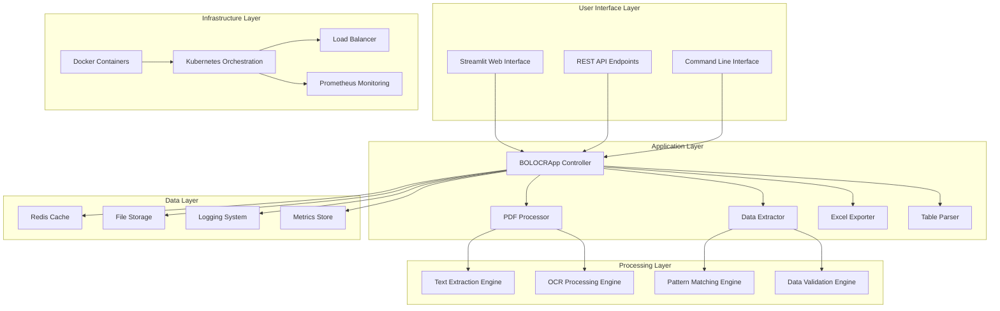
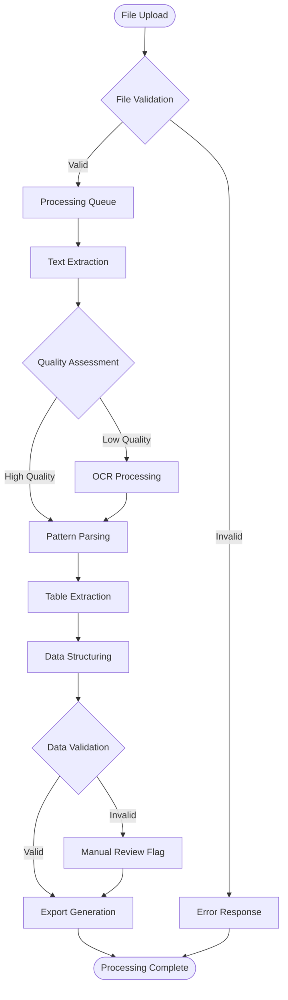
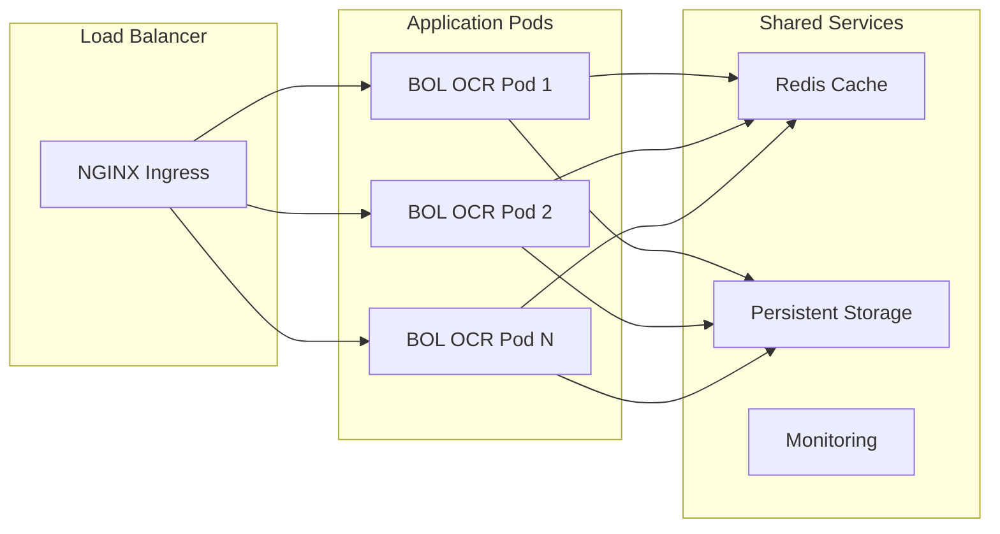

# BOL OCR Extractor - System Architecture Documentation

## Executive Summary

The BOL OCR Extractor is a production-ready, containerized application designed for high-throughput processing of Bill of Lading (BOL) documents. The system leverages hybrid text extraction and OCR technologies to extract structured data from PDF documents, with enterprise-grade security, monitoring, and scalability features.

## Table of Contents

1. [High-Level Architecture](#high-level-architecture)
2. [Component Architecture](#component-architecture)
3. [Data Flow Architecture](#data-flow-architecture)
4. [Security Architecture](#security-architecture)
5. [Performance Architecture](#performance-architecture)
6. [Deployment Architecture](#deployment-architecture)
7. [Integration Patterns](#integration-patterns)
8. [Scalability Design](#scalability-design)

## High-Level Architecture



### System Characteristics

- **Architecture Pattern**: Layered Architecture with Microservice-Ready Components
- **Processing Model**: Hybrid Synchronous/Asynchronous Processing
- **Data Flow**: Pipeline-based Processing with Quality Gates
- **Scalability**: Horizontal Scaling via Container Orchestration
- **Reliability**: Circuit Breaker Pattern with Graceful Degradation

## Component Architecture

### Core Application Components

#### 1. BOLOCRApp (Application Controller)
```python
class BOLOCRApp:
    """
    Primary application controller orchestrating all processing workflows.
    
    Responsibilities:
    - Request routing and validation
    - Batch processing coordination
    - Error handling and recovery
    - Progress tracking and reporting
    - Resource management
    """
```

**Key Features:**
- Session state management
- Progress tracking with real-time updates
- Memory-efficient batch processing
- Comprehensive error handling
- Multi-format file support (PDF, ZIP archives)

#### 2. PDFProcessor (Document Processing Engine)
```python
class PDFProcessor:
    """
    Hybrid PDF processing engine with intelligent fallback mechanisms.
    
    Processing Chain:
    1. Text extraction attempt (pdfplumber)
    2. Quality assessment
    3. OCR fallback if needed (pytesseract)
    4. Confidence scoring
    """
```

**Processing Intelligence:**
- Automatic text quality assessment
- Smart OCR fallback triggering
- Multi-page document handling
- Memory-optimized processing
- Performance monitoring

#### 3. BOLDataExtractor (Data Extraction Engine)
```python
class BOLDataExtractor:
    """
    Configurable pattern-based data extraction engine.
    
    Extraction Pipeline:
    1. Pattern matching via FieldPatterns
    2. Data cleaning and normalization
    3. Field validation
    4. Confidence scoring
    5. Structured data output
    """
```

**Advanced Features:**
- 15+ configurable regex patterns
- Multi-language support capability
- Fuzzy matching for degraded text
- Context-aware field extraction
- Business rule validation

#### 4. FieldPatterns (Pattern Management System)
```python
class FieldPatterns:
    """
    Centralized pattern management for BOL field extraction.
    
    Pattern Categories:
    - Identification patterns (BOL numbers)
    - Party patterns (Shipper, Consignee, Notify)
    - Logistics patterns (Vessels, Ports, Dates)
    - Cargo patterns (Descriptions, Weights, Quantities)
    - Terms patterns (Freight terms, Payment)
    """
```

**Pattern Intelligence:**
- Case-insensitive matching
- Multi-format date recognition
- International address parsing
- Cargo description standardization
- Weight/quantity unit normalization

### Processing Components

#### 5. TableParser (Structured Data Processor)
```python
class TableParser:
    """
    Tabular data extraction using tabula-py integration.
    
    Capabilities:
    - Multi-table extraction
    - Cargo manifest parsing
    - Container detail extraction
    - Custom table format recognition
    """
```

#### 6. ExcelExporter (Output Generation Engine)
```python
class ExcelExporter:
    """
    Professional-grade export system with multiple format support.
    
    Export Features:
    - Multi-sheet Excel workbooks
    - Summary statistics generation
    - Custom formatting and styling
    - CSV alternative format
    - Batch metadata inclusion
    """
```

## Data Flow Architecture

### Processing Pipeline Overview



### Data Processing Stages

#### Stage 1: Input Processing
- **File Validation**: MIME type checking, size limits, format verification
- **Queue Management**: Batch optimization, resource allocation
- **Security Scanning**: Malware detection, content filtering

#### Stage 2: Content Extraction
- **Text Extraction**: Primary extraction via pdfplumber
- **Quality Assessment**: Character count, structure detection, field presence
- **OCR Fallback**: Triggered for scanned documents or poor quality text
- **Confidence Scoring**: Extraction quality metrics (high/medium/low)

#### Stage 3: Data Processing
- **Pattern Matching**: Regex-based field extraction
- **Table Processing**: Structured data from tabular content
- **Data Cleaning**: Normalization, formatting, validation
- **Business Rules**: Field relationships, required field validation

#### Stage 4: Output Generation
- **Structured Data**: BOLData object creation
- **Export Formatting**: Excel/CSV generation with metadata
- **Quality Metrics**: Processing statistics, confidence scores
- **Error Reporting**: Failed extractions, partial results

### Data Models

#### BOLData Structure
```python
@dataclass
class BOLData:
    """Complete BOL data model with metadata"""
    # Identification
    filename: str
    bol_number: str
    
    # Parties
    shipper_name: str
    shipper_address: str
    consignee_name: str
    consignee_address: str
    notify_party_name: str
    notify_party_address: str
    
    # Logistics
    vessel_name: str
    voyage_number: str
    port_of_load: str
    port_of_discharge: str
    
    # Cargo
    description_of_goods: str
    quantity_packages: str
    gross_weight: str
    net_weight: str
    
    # Terms
    freight_terms: str
    date_of_issue: str
    
    # Processing Metadata
    extraction_method: str
    extraction_confidence: str
    processing_notes: str
    extraction_failed: bool
```

## Security Architecture

### Security Layers

#### 1. Network Security
- **TLS Termination**: SSL/TLS encryption for all communications
- **Network Policies**: Kubernetes network segmentation
- **Firewall Rules**: Port-based access control
- **DDoS Protection**: Rate limiting and request throttling

#### 2. Application Security
- **Input Validation**: File type, size, and content validation
- **Sanitization**: Content filtering and malware scanning
- **Authentication**: User session management
- **Authorization**: Role-based access control (RBAC)

#### 3. Data Security
- **Encryption at Rest**: Sensitive data encryption
- **Encryption in Transit**: All communications encrypted
- **Data Masking**: PII protection in logs and exports
- **Audit Logging**: Complete processing audit trail

#### 4. Container Security
- **Image Scanning**: Vulnerability detection in base images
- **Runtime Security**: Container behavior monitoring
- **Pod Security Policies**: Kubernetes security constraints
- **Secret Management**: Encrypted secret storage and rotation

### Security Controls

```yaml
Security Controls Matrix:
  Authentication:
    - Session-based authentication
    - Token-based API access
    - Multi-factor authentication support
    
  Authorization:
    - Role-based permissions
    - Resource-level access control
    - Audit trail logging
    
  Data Protection:
    - Field-level encryption
    - PII data masking
    - Secure data disposal
    
  Infrastructure:
    - Container image scanning
    - Network policy enforcement
    - Secret rotation automation
```

## Performance Architecture

### Performance Characteristics

#### Processing Performance
- **Text-based PDFs**: 2-5 seconds per document
- **OCR Processing**: 15-45 seconds per document
- **Batch Processing**: 100 documents in <30 minutes
- **Memory Usage**: <1GB for standard batches
- **CPU Utilization**: Optimized for multi-core processing

#### Scalability Metrics
- **Horizontal Scaling**: Auto-scaling based on queue depth
- **Resource Allocation**: Dynamic CPU/memory allocation
- **Load Distribution**: Round-robin with health checking
- **Cache Utilization**: Redis-based result caching

### Performance Optimization Strategies

#### 1. Processing Optimization
```python
# Parallel Processing Implementation
class ParallelProcessor:
    def __init__(self, max_workers=4):
        self.executor = ThreadPoolExecutor(max_workers=max_workers)
        self.semaphore = Semaphore(max_workers)
    
    async def process_batch(self, files):
        tasks = [self.process_single_file(file) for file in files]
        return await asyncio.gather(*tasks, return_exceptions=True)
```

#### 2. Memory Optimization
- **Streaming Processing**: Large file handling without full memory load
- **Garbage Collection**: Explicit cleanup after processing
- **Memory Pooling**: Reusable memory allocation
- **Resource Monitoring**: Real-time memory usage tracking

#### 3. Caching Strategy
- **Result Caching**: Redis-based extraction result storage
- **Pattern Caching**: Compiled regex pattern caching
- **Image Caching**: OCR image preprocessing cache
- **Configuration Caching**: Runtime configuration optimization

## Deployment Architecture

### Container Architecture

```dockerfile
# Multi-stage build for optimized image size
FROM python:3.11-slim as builder
# Build dependencies and install packages

FROM python:3.11-slim as runtime
# Runtime environment with minimal footprint
COPY --from=builder /usr/local/lib/python3.11/site-packages /usr/local/lib/python3.11/site-packages
```

### Kubernetes Architecture

```yaml
apiVersion: apps/v1
kind: Deployment
metadata:
  name: bol-ocr-app
spec:
  replicas: 3
  strategy:
    type: RollingUpdate
    rollingUpdate:
      maxSurge: 1
      maxUnavailable: 0
  template:
    spec:
      containers:
      - name: bol-ocr-app
        image: bol-ocr-extractor:latest
        resources:
          requests:
            memory: "512Mi"
            cpu: "250m"
          limits:
            memory: "2Gi"
            cpu: "1000m"
```

### Infrastructure Components

#### 1. Load Balancing
- **NGINX Ingress**: SSL termination and load balancing
- **Session Affinity**: Sticky sessions for file uploads
- **Health Checks**: Application readiness and liveness probes
- **Rate Limiting**: Request throttling and queue management

#### 2. Monitoring Stack
- **Prometheus**: Metrics collection and alerting
- **Grafana**: Performance dashboards and visualization
- **Jaeger**: Distributed tracing for request flows
- **ELK Stack**: Centralized logging and analysis

#### 3. Data Persistence
- **Redis**: Session storage and result caching
- **Persistent Volumes**: File storage and backup
- **Database**: Audit logging and metadata storage

## Integration Patterns

### API Integration

#### REST API Endpoints
```python
@app.route('/api/v1/extract', methods=['POST'])
def extract_bol_data():
    """
    Primary extraction endpoint
    
    Request: Multipart form with PDF files
    Response: Structured BOL data with metadata
    """
    
@app.route('/api/v1/batch', methods=['POST'])
def batch_extract():
    """
    Batch processing endpoint
    
    Request: ZIP archive or multiple files
    Response: Processing job ID and status
    """
```

#### Webhook Integration
```python
class WebhookManager:
    """
    Webhook notification system for processing status updates
    
    Supported Events:
    - processing.started
    - processing.completed
    - processing.failed
    - batch.completed
    """
```

### External Service Integration

#### 1. Cloud Storage Integration
- **AWS S3**: Document storage and archival
- **Google Cloud Storage**: Alternative cloud storage
- **Azure Blob Storage**: Enterprise storage integration
- **MinIO**: Private cloud storage option

#### 2. Document Management Systems
- **SharePoint**: Enterprise document integration
- **Google Drive**: Cloud document access
- **Dropbox Business**: File synchronization
- **Box**: Secure enterprise file sharing

#### 3. ERP/CRM Integration
- **SAP**: Enterprise resource planning integration
- **Oracle**: Database and application integration
- **Salesforce**: Customer relationship management
- **Microsoft Dynamics**: Business application suite

## Scalability Design

### Horizontal Scaling Architecture



### Auto-scaling Configuration

```yaml
apiVersion: autoscaling/v2
kind: HorizontalPodAutoscaler
metadata:
  name: bol-ocr-hpa
spec:
  scaleTargetRef:
    apiVersion: apps/v1
    kind: Deployment
    name: bol-ocr-app
  minReplicas: 2
  maxReplicas: 10
  metrics:
  - type: Resource
    resource:
      name: cpu
      target:
        type: Utilization
        averageUtilization: 70
  - type: Resource
    resource:
      name: memory
      target:
        type: Utilization
        averageUtilization: 80
  - type: Pods
    pods:
      metric:
        name: processing_queue_depth
      target:
        type: AverageValue
        averageValue: "5"
```

### Scalability Considerations

#### 1. Stateless Design
- **Session Storage**: External Redis-based session management
- **File Processing**: Temporary file cleanup after processing
- **Configuration**: Environment-based configuration management
- **Health Checks**: Application-level health monitoring

#### 2. Resource Optimization
- **CPU Scaling**: Based on processing queue depth
- **Memory Scaling**: Dynamic allocation based on batch size
- **Storage Scaling**: Auto-expanding persistent volumes
- **Network Scaling**: Load balancer capacity adjustment

#### 3. Performance Monitoring
- **Real-time Metrics**: Processing time, success rates, error rates
- **Capacity Planning**: Resource utilization trending
- **Alerting**: Proactive scaling triggers
- **SLA Monitoring**: Service level agreement compliance

## Conclusion

The BOL OCR Extractor architecture provides a robust, scalable, and secure foundation for enterprise-grade document processing. The system's layered architecture, comprehensive security model, and cloud-native deployment strategy ensure reliable operation at scale while maintaining high performance and data integrity.

Key architectural strengths:
- **Modularity**: Clean separation of concerns enabling independent scaling
- **Resilience**: Circuit breaker patterns and graceful degradation
- **Security**: Defense-in-depth security model
- **Observability**: Comprehensive monitoring and logging
- **Scalability**: Horizontal scaling with auto-scaling capabilities

The architecture supports both current requirements and future enhancements, providing a solid foundation for continued development and expansion.